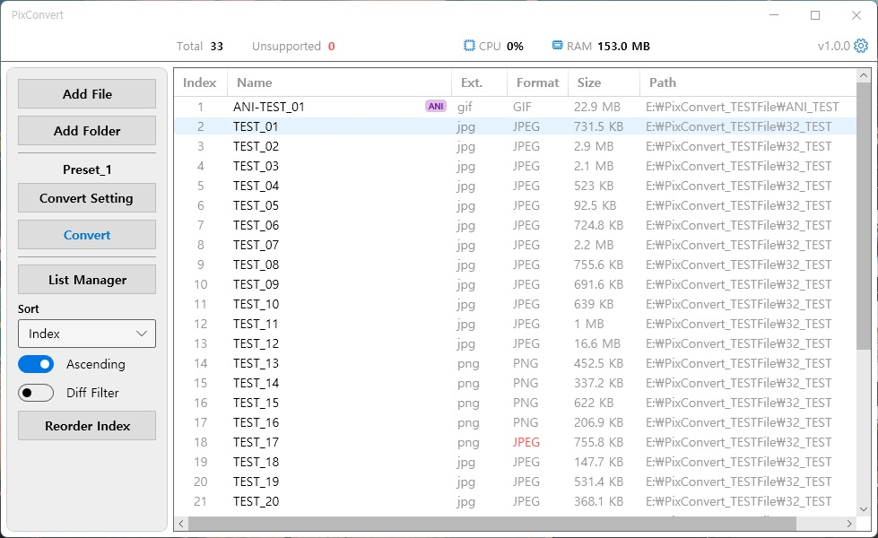
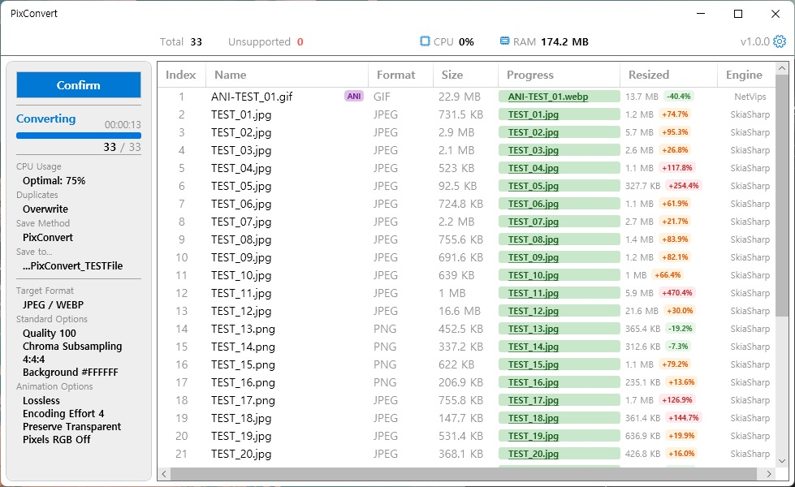

[](README.md)
[](README.ko.md)

---

# PixConvert

> A Windows image converter for batch conversion, presets, and mixed static/animated image workflows.


## Quick Start

1. Download the latest zip package from [GitHub Releases](https://github.com/lsj1206/PixConvert/releases).
2. Extract the zip file to a writable folder.
3. Run `PixConvert.exe`.
4. Add files or folders to the list.
5. Configure or select a conversion preset.
6. Start conversion and check the output files.

For runtime use, keep `PixConvert.exe` and `libvips-42.dll` in the same folder. The release zip also includes `LICENSE` and `THIRD-PARTY-NOTICES.md` for license and redistribution notices.

## Highlights

- Batch convert up to `10,000` image files.
- Handle static images and supported animated images in one list.
- Detect the actual image format from file signatures instead of relying only on extensions.
- Show files whose extension and detected format do not match.
- Reuse conversion settings with presets.
- Control CPU usage while conversion is running.
- Choose how output conflicts are handled: overwrite, skip, or add a suffix.
- Keep settings, presets, and logs inside the application folder for zip-based distribution.

## Screenshots

#### Before Conversion



#### Converting



## Supported Formats

| Type            | Formats                              |
| --------------- | ------------------------------------ |
| Static images   | `JPEG`, `PNG`, `BMP`, `WebP`, `AVIF` |
| Animated images | `GIF`, `WebP`                        |

## Conversion Engines

PixConvert uses two conversion engines depending on the target workload.

[SkiaSharp](https://github.com/mono/skiasharp) is a .NET graphics library based on Google's `Skia` 2D graphics engine.

> PixConvert uses SkiaSharp for static image conversion: `JPEG`, `PNG`, `BMP`, and static `WebP`.

`BMP` cannot be saved through the normal SkiaSharp encoding path, so PixConvert uses an internal `BmpEncoder`. It writes the converted pixels as an uncompressed 24-bit bitmap, and images with transparency are first composited over the configured background color.

[NetVips](https://github.com/kleisauke/net-vips) is a .NET binding for `libvips`, a high-performance C image processing library.

> PixConvert uses NetVips for high-compression and multi-frame workloads: `AVIF`, animated `GIF`, and animated `WebP`.

`AVIF` and animated images have more encoding options and higher processing cost, so they are routed through NetVips. PixConvert uses it for AVIF compression options and frame-based GIF/WebP animation output.

## Development

- Language: C#
- Framework: .NET 10.0
- UI: WPF with [ModernWPF](https://github.com/Kinnara/ModernWPF)
- Core libraries: SkiaSharp, NetVips, CommunityToolkit.Mvvm, Serilog
- Tools: Antigravity, VS Code, Visual Studio, Claude Desktop
- AI: Gemini, Codex, Claude
- Devlog: [Shortcut](https://lsj1206.github.io/post/05/)

Build from source:

```powershell
dotnet build src\PixConvert.csproj -c Release
```

## License

PixConvert is licensed under the terms in [LICENSE](LICENSE).
Third-party notices for redistributed dependencies are listed in [THIRD-PARTY-NOTICES.md](THIRD-PARTY-NOTICES.md).
